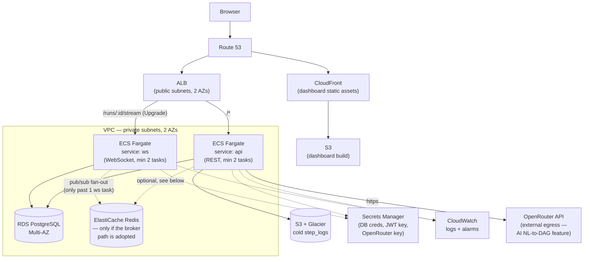

# ARCHITECTURE.md

How FlowForge runs today (docker-compose, single API process, in-process
worker pool — see the root README) versus how it would be deployed to AWS if
this moved past a take-home MVP. Diagram + prose, no IaC — Task.md's Phase 6
scope explicitly excludes Terraform/CDK for this deliverable; the module
boundaries a real implementation would use are sketched in
`flowforge-analysis.md` §17 as reference material, not committed here.

## Deployment diagram

## What's running today vs. what this diagram adds

The current system is deliberately one process: Fastify serves REST *and*
the `WS /runs/:id/stream` upgrade on the same `http.Server`
(`realtime/gateway.ts`), and `execution/worker.ts`'s poll loop runs in that
same process (started from `server.ts`). There's no load balancer, no
autoscaling, one Postgres instance, no Redis, no CDN — `docker compose up`
is the entire deployment target, correctly for a 4-day MVP. Everything below
describes the AWS shape this would take on if it needed to run for real
users, and *why*, not what's implemented now.

## API / WebSocket split

**First thing to split off, before anything else on this diagram.** They're
one Fastify process today. The reason to separate them in production: a
stateless REST request completes in milliseconds and autoscales cleanly on
request count; a WebSocket connection is long-lived and behaves completely
differently under a rolling deploy — draining connections gracefully on
`api` (mid-flight HTTP requests) is a different problem than draining
`ws` (thousands of open sockets that all need to reconnect somewhere).
Scaling them together means a REST traffic spike forces new WS-capable tasks
to spin up for no reason, and a deploy that's safe for REST (finish
in-flight requests, exit) is disruptive for WS (every connected client gets
dropped).

Splitting them is *only* a routing + process change — `gateway.ts` and
`routes.ts` already don't share mutable state beyond the DB and
`RunPublisher` — until `RunPublisher`'s in-process room map is replaced with
Redis pub/sub (see below), so this is genuinely a "config change, not a
rewrite" first move once traffic justifies it.

## Load balancing

One ALB, two target groups: `/*` routes to the `api` service, the WS upgrade
path (`/runs/:id/stream`) routes to `ws`. ALB (not NLB) because both
services are HTTP(S) — path-based routing and the WebSocket-aware target
group both need an *application* load balancer, and there's no case here
for NLB's raw TCP passthrough.

## Autoscaling strategy

`api`: target-tracking on ALB `RequestCountPerTarget` plus a CPU
target-tracking policy as a floor, min 2 tasks (HA — no single point of
failure across AZs), max capped per environment for cost control. `ws`
scales on concurrent-connection count instead of request rate — connection
count is what actually predicts memory/CPU pressure for a WS-serving task,
request-rate metrics don't mean anything for a service that mostly holds
idle sockets open. Both scale independently once split, which is the whole
point of splitting them.

## Why ECS Fargate over EKS or self-managed

No cluster control-plane to operate. EKS's value is Kubernetes-specific
primitives — custom operators, multi-tenant cluster sharing, complex
scheduling constraints — none of which this system needs at founding-team
scale. Fargate gets container orchestration, autoscaling, and AZ placement
without anyone on a small team owning cluster upgrades. Revisit if/when the
team and workload are actually large enough that Kubernetes-specific
features would be used, not before.

## Why RDS over self-managed Postgres

Managed automated failover (Multi-AZ), automated backups with
point-in-time recovery, and managed patching outweigh the cost delta for a
team that can't afford a database outage to also mean paging the one
engineer who knows how to fail a self-managed primary over. `runs` and
`step_logs` are the write-heavy tables in this schema (see `db/README.md`'s
EXPLAIN write-up) — RDS Proxy is the documented next step if Fargate task
count grows enough that connection count against RDS becomes the
bottleneck, rather than hand-rolling a pooler.

## Redis — only if the broker path is adopted

Today's execution engine is deliberately broker-free: an in-process worker
pool polling `runs WHERE status='pending'` with `FOR UPDATE SKIP LOCKED`
(see `execution/worker.ts`) — Task.md's locked decision, and it already
supports horizontal scaling correctly (two `api` tasks running the same poll
loop can't double-claim a row; the `SKIP LOCKED` claim query is exactly what
makes that safe). ElastiCache Redis only enters the picture for two
*separate* reasons, neither required at MVP scale:

1. **If** the worker pool is swapped for a real queue (BullMQ/SQS) once
   throughput needs backpressure beyond what polling gives — this system's
   documented production swap-in, not something built here.
2. **Once `ws` is split into more than one task**, `RunPublisher`'s room map
   (`realtime/publisher.ts`) is in-process `Map<runId, Set<WebSocket>>` — a
   second `ws` task has no way to see rooms opened on the first one. Redis
   pub/sub is what makes "publish an event to run X's room" work
   cluster-wide once there's more than one task publishing/subscribing. This
   is called out as a `ponytail:` comment in `publisher.ts` today.

## Egress: OpenRouter

The NL→DAG AI feature (`apps/api/src/ai/`) calls OpenRouter's API from the
`api` service — the one external network dependency this system has beyond
its own database. In the AWS shape, that's outbound HTTPS from the `api`
Fargate tasks' private subnets through a NAT gateway, with the API key held
in Secrets Manager and injected as a task env var, never baked into the
image (see `.env.example` / `config.ts`'s `openrouterApiKey`). Losing
connectivity to OpenRouter degrades the AI feature only — the rest of the
system (CRUD, execution, realtime) has no dependency on it, by design (see
`ai/README.md`).

## Cold log storage

`step_logs` is one time-indexed Postgres table today — no partitioning, no
second engine (see `db/README.md`'s full justification). The scale path
that requires no schema change: a scheduled job ages rows past a retention
window (30–90 days) out to S3, optionally through Glacier for long-tail
retention, keeping only the hot window in RDS.

## Cross-cutting (named, not built here)

- **Secrets Manager** for DB credentials, JWT signing key, and the
  OpenRouter API key — injected as task environment variables at deploy
  time.
- **CloudWatch** for the structured JSON logs both services already emit
  (`consoleExecutionLogger`, Fastify's pino logger), plus alarms on 5xx
  rate, task health, and RDS CPU/connections.
- **WAF** on the ALB — a basic rate-based rule and AWS-managed rule groups.
  Cheap, and worth adding before any public launch.

## Future scaling strategy, in the order it'd actually get done

1. Split `api`/`ws` into separate Fargate services (above) — the first
   move, and mostly a routing change against code that's already shaped for
   it.
2. Add Redis pub/sub to `RunPublisher` once `ws` runs more than one task.
3. Swap the in-process worker pool for a real queue (BullMQ + this same
   Redis, or SQS) once run volume needs backpressure beyond what polling
   `runs` gives.
4. RDS Proxy in front of RDS once Fargate task count makes raw connection
   count a problem.
5. Partition or cold-archive `step_logs` once its row count — not before —
   makes the single-table index stop being the right answer (see
   `db/README.md`).

Each step is additive to what's running today, not a rewrite — the
Skip-Locked worker pool, the tenant-scoped WS rooms, and the single
`step_logs` table are all already shaped to grow into this, not to be
replaced by it.
