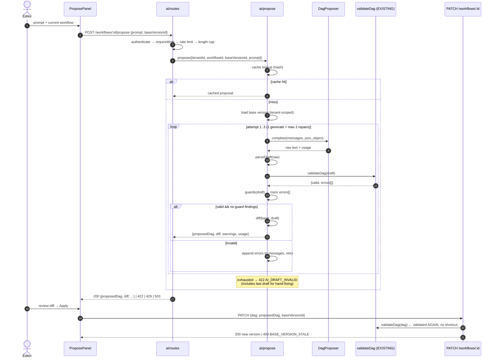

# FlowForge — AI Subsystem Design

**Feature:** Natural-language → *proposed workflow version*
**Status:** Design, pre-implementation. Hand this to an implementer.
**Scope:** Phase 5 of `Task.md`. Additive. No redesign of existing modules.

---

## 0. Thesis (read once)

> The LLM is an untrusted contributor. It opens a pull request against a workflow. It gets no privileged path — same validator, same versioning, same rollback as a human.

Three constraints follow from that sentence, and every decision below is downstream of them:

1. **Exactly one persistence path.** `/propose` writes nothing. The client saves through the existing `PATCH /workflows/:id`.
2. **The existing validator is the only trust boundary.** `validateDag()` in `workflows/dag-validation.ts` — whose own docstring already reserves itself for "both manually-authored and (later, Phase 5) LLM-generated DAGs".
3. **Delete `src/ai/` and the product still works.** Nothing outside `ai/` may import from inside it, except one route registration line in `app.ts`.

### Why the provider choice sharpens this

Project decision: **OpenRouter** (OpenAI-compatible), **official `openai` Node SDK**, **free models only**, no provider-specific features.

Free models are unreliable schema-followers. Support for strict `json_schema` is inconsistent across them; some do not honor `response_format` at all. That is normally a problem. Here it is the point: the architecture already assumes the model's output is garbage until proven otherwise, so a weak model degrades the *hit rate*, not the *safety*. A design that needs a frontier model to be correct was never safe — it was lucky.

**Corollary — the canonical schema is NOT the wire contract.** `WorkflowDagDefinition` cannot be handed to OpenAI strict mode verbatim:

| Schema feature | Strict-mode reality |
|---|---|
| `Type.Optional` on `headers`, `body`, `args` | strict requires *all* properties in `required` |
| `minLength`, `minimum`, `maximum`, `minItems` | not honored |
| `format: 'uri'` | not enforced |
| `Type.Unknown()` (http `body`) | untyped `{}` |
| `additionalProperties: false` | ✅ already satisfied |

Writing an adapter to satisfy strict mode produces a schema that no longer describes what Ajv enforces. So: **the prompt gets a derived, advisory rendering of the schema; Ajv enforces the real one.** One source of truth for enforcement, preserved.

---

## 1. Final architecture

```
┌────────────────────────── apps/dashboard ──────────────────────────┐
│  ProposePanel ──► useProposal ──► POST /workflows/:id/propose      │
│       │                                                            │
│       └── DiffView ──► "Apply" ──► PATCH /workflows/:id  ◄── the   │
│                                     ONLY write path        same as │
└─────────────────────────────────────────────────────────── a human ┘
                                  │
┌──────────────────────────── apps/api ─────────────────────────────┐
│  ai/routes.ts   authenticate → requireWrite → tenant rate limit    │
│       │                                                            │
│       ▼                                                            │
│  ai/propose.ts  ORCHESTRATOR (no I/O of its own)                   │
│       ├─► cache lookup ......... hash(tenantId+baseVersionId+text) │
│       ├─► ai/prompt.ts ......... PURE. schema + few-shot + input   │
│       ├─► DagProposer .......... INTERFACE (openrouter | mock)     │
│       ├─► parseDraft() ......... tolerant JSON extraction          │
│       ├─► validateDag() ........ ⚠ EXISTING. THE TRUST BOUNDARY    │
│       ├─► ai/guards.ts ......... PURE. SSRF + command allowlist    │
│       ├─► repair loop .......... max 2, feeds errors back          │
│       └─► ai/diff.ts ........... PURE. proposed vs base            │
└────────────────────────────────────────────────────────────────────┘
                                  │
                    OpenRouter (OpenAI-compatible)
```

**Reused, unchanged:** `validateDag` / `buildExecutionPlan` / Kahn cycle detection · `TokenBucketLimiter` · `AppError` + error envelope · `app.authenticate` / `app.requireWrite` · `PATCH /workflows/:id` · immutable versioning + rollback · `WorkflowDagDefinition`.

**New dependency:** `openai` (one, in `apps/api`). Justified: it is the OpenRouter-recommended client, gives typed request/response shapes and correct `Retry-After` handling on 429 — which free-tier traffic *will* hit and which is easy to hand-roll subtly wrong.

**One deliberate touch outside `ai/`:** an optional `baseVersionId` on `UpdateWorkflowBody` (§4.3). ~5 lines, purely additive, default behavior unchanged.

---

## 2. Sequence diagram



**Note step 22.** The proposed DAG is validated a second time on `PATCH`, by the same function. This is not redundant — it is the guarantee that `/propose` holds no privilege. A client that fabricates a `proposedDag` and posts it directly is indistinguishable from one that got it from the model, and both are checked identically.

---

## 3. Folder structure

```
apps/api/src/ai/
├── provider.ts     # DagProposer interface, Usage, MockProposer
├── openrouter.ts   # OpenRouter impl via `openai` SDK
├── prompt.ts       # PURE: message composition + few-shot examples
├── guards.ts       # PURE: SSRF + command allowlist → DagValidationError[]
├── diff.ts         # PURE: DagDiff computation
├── propose.ts      # orchestration: cache, repair loop, validation
├── errors.ts       # AiUnavailableError, AiDraftInvalidError, BaseVersionStaleError
└── routes.ts       # POST /workflows/:id/propose

apps/dashboard/src/ai/
├── ProposePanel.tsx  # textarea + submit + error states
├── DiffView.tsx      # added/removed/modified, reuses statusColor.ts conventions
└── useProposal.ts    # plain hook + fetch (matches api.ts / useRunStream.ts; no react-query)

apps/api/test/
├── ai-prompt.test.ts    ai-diff.test.ts     ai-guards.test.ts
├── ai-propose.test.ts   ai-routes.test.ts
```

Five of the eight backend files are pure functions with no I/O. That ratio is the design.

---

## 4. API contract

### 4.1 `POST /workflows/:id/propose`

`:id` = workflow UUID, or the literal `new` for greenfield (then `baseVersionId` must be omitted).
Guards: `app.authenticate` → `app.requireWrite` (editor+; viewers must not spend budget) → AI rate limit.

**Request**
```jsonc
{
  "prompt": "string, 1..2000 chars",
  "baseVersionId": "uuid"   // required unless :id === 'new'
}
```

**200**
```jsonc
{
  "proposedDag": { "steps": [ /* WorkflowDagDefinition */ ] },
  "diff": {
    "added":    ["notify"],
    "removed":  [],
    "modified": [{ "key": "fetch", "fields": ["url", "method"] }],
    "unchanged":["seed"]
  },
  "warnings": [{ "path": "/steps/notify", "message": "..." }],
  "meta": { "model": "…:free", "attempts": 2, "cached": false,
            "usage": { "promptTokens": 1840, "completionTokens": 260 } }
}
```

**Errors** — all via the existing `{ error: { code, message, details? } }` envelope.

| Status | Code | When |
|---|---|---|
| 400 | `VALIDATION_ERROR` | body fails route schema (existing handler) |
| 403 | `FORBIDDEN` | viewer (existing `requireWrite`) |
| 404 | `NOT_FOUND` | workflow/version not in tenant (existing) |
| 409 | `BASE_VERSION_STALE` | `baseVersionId` ≠ current at propose time |
| 422 | `AI_DRAFT_INVALID` | repair exhausted. `details: { errors, lastDraft }` |
| 429 | `RATE_LIMITED` | tenant AI bucket empty (existing) |
| 503 | `AI_UNAVAILABLE` | provider down / timeout / free-tier cap. `details: { retryable: true }` |

### 4.2 Provider interface

```ts
interface DagProposer {
  complete(messages: ChatMessage[]): Promise<{ text: string; usage: Usage }>;
}
```
Deliberately dumb: it returns **text**, not a DAG. It does not parse, validate, or retry. Swapping OpenRouter for anything else touches one file. `MockProposer` implements the same interface and is what tests and `AI_PROVIDER=mock` use.

### 4.3 The one change outside `ai/`

`UpdateWorkflowBody` gains `baseVersionId: Type.Optional(Type.String({ format: 'uuid' }))`. When present, `updateWorkflow` asserts `current_version_id === baseVersionId` **inside its existing transaction** and throws 409 otherwise. When absent, behavior is byte-identical to today.

> **⚠ Implementation assumption to verify first.** I have not read `workflows/repository.ts:updateWorkflow`. This design assumes it already runs its read-then-write in one transaction. If it does not, the CAS is unsound under concurrency — **do not paper over it**; report back and we decide whether to fix the transaction or drop the CAS to a best-effort pre-check.

---

## 5. Request / response schemas

TypeBox, in `ai/routes.ts`, matching existing route style:

```ts
ProposeParams = { id: string }                       // uuid | 'new'
ProposeBody   = { prompt: string(1..2000),
                  baseVersionId?: string(uuid) }
```

The 2000-char cap is enforced **server-side by the route schema** (the client counter in §16 is UX, not security). Rejection happens before any provider call — `ai-routes.test.ts` asserts the mock was never invoked.

`DagDiff` and `Usage` live in `ai/diff.ts` / `ai/provider.ts`. They are **not** promoted to `packages/shared-types` — that package is the DAG contract, and diluting it with AI response shapes for one consumer is exactly the coupling this subsystem is supposed to avoid. The dashboard re-declares the ~10-line response type locally. If a second consumer ever appears, promote it then.

---

## 6. Prompt composition strategy

`ai/prompt.ts` is **pure**: `(schemaJson, examples, baseDag, userText, priorErrors?) → ChatMessage[]`. Same inputs, same messages. Fully unit-testable, no network.

**System message**
1. Role: "You translate descriptions into FlowForge workflow DAGs. Output JSON only."
2. **Derived schema.** `JSON.stringify(WorkflowDagDefinition)` — imported from `@flowforge/shared-types`, never hand-copied. If the schema changes, the prompt changes with it, automatically.
3. Closed vocabulary: `http | script | delay | condition`, stated as exhaustive.
4. Hard rules: `dependsOn` references existing keys only; no cycles; keys unique; no self-deps. (These mirror the validator's actual checks — the prompt asks for what Ajv will demand.)
5. Two few-shot examples: one linear, one diamond. **Typed as `WorkflowDagDefinition` in source**, so `tsc` fails the build if an example drifts from the schema. A stale few-shot example teaching the model an invalid shape is a silent poisoning; the compiler prevents it.

**User message** — delimited, never interpolated into the system message:
```
<current_workflow>{baseDag JSON, or "none — new workflow"}</current_workflow>
<request>{user text, verbatim, untrusted}</request>
```

**Repair message** (attempts 2–3) — appends the assistant's failed output plus:
```
<validation_errors>[{ "path": "/steps/x/dependsOn", "message": "unknown dependency \"y\"" }]</validation_errors>
Fix these errors. Output the corrected complete JSON.
```
The error objects are `DagValidationError[]` **verbatim from the existing validator**. No translation layer. The `path`/`message` shape the engine already produces is exactly what a model needs to self-correct — a genuine, free reuse.

**Two few-shot examples, not three.** Free models have tight context budgets and no prompt caching; the third example costs tokens on every attempt for marginal gain. Revisit if the spike shows conditional workflows failing.

---

## 7. Structured-output strategy

**Decision: `response_format: { type: 'json_object' }` (JSON mode). Not strict `json_schema`. Not tool-calling.**

Rationale, in order:
1. Strict `json_schema` is inconsistently supported across OpenRouter free models.
2. **Your schema is strict-incompatible anyway** (§0 table) — using it would require a lossy adapter, breaking the single-source-of-truth property that is the feature's main selling point.
3. Tool-calling is worse: even patchier on free models, and it is a *transport* for the same JSON.
4. The repair loop already handles non-conformance. Strict mode would only raise the first-attempt hit rate — an *efficiency* gain, not a *safety* one.

**Tolerant parsing.** `parseDraft(text)` in `propose.ts`, tried in order: (a) `JSON.parse`; (b) extract a ```json fenced block; (c) extract the first balanced `{...}`. Failure → synthesize `{ path: '/', message: 'model did not return parseable JSON' }` and feed it into the repair loop like any other error.

`Task.md:130` says "use structured-output mode, not parse-JSON-from-prose." We request JSON mode — we *prefer* structured output. We tolerate prose because free models are inconsistent, and the alternative is a feature that breaks when the model adds ```` ```json ````. **Record this deviation and its reason in the README trade-offs section.** Either path lands in the same validator, so tolerance costs nothing in safety.

**Upgrade path (documented, not built):** on a paid model, add strict `json_schema` behind one config flag, using a hand-maintained *prompt* schema that is asserted-equal to the canonical one in a test. Out of scope for 4 days.

---

## 8. Validation pipeline

Ordered, fail-fast, cheapest first. **Stages 1–3 run before any token is spent.**

| # | Stage | Where | On failure |
|---|---|---|---|
| 1 | AuthN/AuthZ | existing `authenticate` + `requireWrite` | 401 / 403 |
| 2 | Route schema (incl. 2000-char cap) | Fastify + TypeBox | 400 |
| 3 | Tenant-scoped base version load | existing repository | 404 / 409 |
| 4 | `parseDraft` | `ai/propose.ts` | → repair loop |
| 5 | **`validateDag(draft)`** | ⚠ **EXISTING — trust boundary** | → repair loop |
| 6 | Semantic guards | `ai/guards.ts` | → repair loop |
| 7 | Diff | `ai/diff.ts` | — |
| 8 | **`validateDag(dag)` again** | ⚠ **EXISTING — on `PATCH`** | 422 |

Stage 5 is `validateDag` **called, not reimplemented**: shape, duplicate keys, self-deps, dangling refs, and Kahn cycle detection. Stage 6 returns the *same* `DagValidationError[]` type, so guard findings flow into the repair loop through the identical channel as schema errors — one mechanism, not two.

### Semantic guards (`ai/guards.ts`) — pure, no I/O

These catch what the JSON schema structurally cannot:

- **`http.url` SSRF guard.** Reject non-`http(s)` protocols; reject loopback (`127.0.0.0/8`, `::1`, `localhost`), link-local (`169.254.0.0/16` — the cloud metadata endpoint), and RFC1918 (`10/8`, `172.16/12`, `192.168/16`).
  *This is not decoration.* Your engine's future `http` handler will fetch this URL **server-side from inside your VPC**. A model writing URLs from user prose is a textbook confused-deputy/SSRF vector, and `format: 'uri'` passing says nothing about whether a URL is *safe*. The guard is a lexical check on the literal string only — it cannot stop DNS rebinding or a redirect to a private IP. **Those are the `http` handler's job, at fetch time, and must be noted as such in the README.** Guarding here reduces blast radius; it does not close the hole.
- **`script.command` allowlist.** Deny-by-default against a small allowlist. `Task.md:28` already commits to a sandboxed subprocess with no net/fs; this is the authoring-time half of that posture.
- **Fan-out sanity.** Reject > 50 steps — bounds the diff, the render, and a prompt-injected DAG bomb.

---

## 9. Retry & repair flow

**Two failure classes, two mechanisms. Conflating them is a bug, not a simplification.**

| | Repair | Transport retry |
|---|---|---|
| Means | model was *wrong* | network was *down* |
| Trigger | parse/validation/guard failure | timeout, 5xx, 429 |
| Handled by | `ai/propose.ts` loop | `openai` SDK (`maxRetries: 2`) |
| Budget | max 2 repairs (3 calls total) | SDK-internal, honors `Retry-After` |
| Cost | a full generation each | usually none |

**Repair loop invariants** (assert all in tests):
- Hard bound: `attempt <= 3`. No condition extends it.
- Each repair appends the failed output + its errors. Context grows, so the cap is also a cost cap.
- **Return the first valid draft.** No "best of N" — that implies a quality ranking we cannot compute.
- Exhaustion is **not** a 500. It is `422 AI_DRAFT_INVALID` with `{ errors, lastDraft }` so the user can hand-fix in the editor. A partly-right draft beats a blank textarea.
- Termination is provable by inspection: the counter is the only loop condition.

---

## 10. Security model

**Untrusted input, untrusted output.** The input is user prose (injection surface). The output is *also* untrusted — a successful injection produces a malicious DAG, and prompt wording will not stop it. The guards in §8 are the control.

- **Tenancy.** `tenantId` from JWT server-side only, never from body/param — the existing cross-cutting invariant, unchanged. Base version loaded tenant-scoped, so a guessed UUID yields 404, not a leak.
- **RBAC.** `requireWrite` (editor+). Generation costs a shared, rate-limited resource; viewers must not spend it.
- **Key handling.** `OPENROUTER_API_KEY` server-side only, read via the existing `config.ts` `required()` pattern. Never reaches the browser: the dashboard calls *your* API, never OpenRouter. `.env` is already gitignored (`.env` + `.env.*`, `!.env.example`) and untracked — verified. `.env.example` gets the key **name with an empty value**, never a value.
  > **Rotate the key that was pasted into chat.** It must be considered compromised. Nothing in this repo will reference the value.
- **Config validation.** `config.ts` currently `required()`s at module load. The AI key must be **optional-with-degradation** — `AI_PROVIDER=mock` and CI must boot without a key. A missing key when `AI_PROVIDER=openrouter` fails at *route registration*, not at import, or you have coupled the whole API's boot to an additive feature.
- **Log hygiene.** Never log raw prompts (tenant PII) or raw completions. Log the prompt **hash**. §14.
- **Egress.** OpenRouter is a new outbound destination. Name it in `ARCHITECTURE.md`.
- **Not defended.** Adversarial injection by an *authenticated editor of their own tenant* — they can already author any DAG directly, so the model grants no new capability. Say this explicitly rather than implying the guards are stronger than they are.

---

## 11. Rate limiting

Three layers, only one of which you control:

1. **Per-tenant AI bucket** — reuse `TokenBucketLimiter`, **a separate instance** from the CRUD limiter. Suggested `{ capacity: 5, refillPerSecond: 0.05 }` (≈1 per 20s, burst 5). CRUD's `{50, 25}` is wildly wrong for a resource that costs money and takes seconds. Instantiated per-app (not module-level), matching the comment at `workflows/routes.ts:75`, so tests never share state.
2. **Response cache** (§13) — absorbs double-submits before they reach layer 3.
3. **OpenRouter free-tier daily cap** — *outside your control*. Free models carry hard provider-side daily caps. **Treat a provider 429 as expected, not exceptional:** map to `503 AI_UNAVAILABLE { retryable: true }`, never a 500.

> **Demo risk, flagged loudly.** If the free-tier cap is exhausted mid-review, the feature is dead on arrival for a reviewer. Mitigations: (a) the cache keeps a rehearsed prompt warm; (b) `AI_PROVIDER=mock` gives a deterministic offline demo — *honest because it is labeled in the UI*, not a fake; (c) the panel's 503 state is designed, not an unhandled crash. Do not discover this on day 4.

---

## 12. Token management

No prompt caching — not available on OpenRouter free models, and provider-specific by definition. Budget accordingly:

- **Input cap 2000 chars**, server-enforced (§5). Rejected before any provider call.
- **`max_tokens: 1500`** — comfortably above a 50-step DAG, hard cap on runaway output.
- **System prompt ≈ 1.5–2k tokens**, dominated by the serialized schema. Acceptable, and the price of not hand-copying it. If the spike shows context pressure on a small free model, drop the second few-shot example *before* touching the schema — the schema is correctness, examples are hit rate.
- **Repairs grow context.** Attempt 3 carries two failed drafts. This is the real reason for the max-2 cap; it is a cost bound, not just a liveness bound.
- **Context ceiling.** Free models vary (8k–64k). Worst case: system + base DAG + prompt + 2 failed drafts. Assert this fits the configured model's window during the spike.
- **`usage` is returned to the client and logged.** On free models cost is 0, so this is about *token counts* and context headroom, not billing. Say that plainly rather than claiming cost observability you do not have.

---

## 13. Caching strategy

In-process `Map` + TTL. No Redis — consistent with `Task.md:24`'s locked no-broker decision, and the same swap story as `TokenBucketLimiter`.

- **Key:** `sha256(tenantId + ':' + (baseVersionId ?? 'new') + ':' + normalizedPrompt)`.
  - `tenantId` in the key is **mandatory**: a cross-tenant cache hit would be a tenancy breach through a side channel — the one place this feature could violate the system's most important invariant. Assert it in a test.
  - `baseVersionId` in the key: the same prompt against a *different* base must produce a different proposal.
  - Normalize = trim + collapse whitespace. Nothing cleverer; semantic similarity caching is a research project, not an MVP.
- **TTL 5 min. Max 100 entries, FIFO eviction.** Bounded, or it is a memory leak.
- **Cache only 200s.** Never cache 422/503 — a transient provider outage must not pin a failure for 5 minutes.
- **`meta.cached: true`** so the demo can show a cache hit, and so tests can assert it.

`// ponytail: in-process cache, per-instance. Redis when the API goes multi-instance — same swap as TokenBucketLimiter.`

---

## 14. Observability

Reuse the existing structured-log shape (`{ level, event, ...fields }`, per `consoleExecutionLogger`). Correlate on `tenantId` + `workflowId` + `proposalId` (a request-scoped UUID), mirroring the run/step correlation convention.

Events: `ai.propose.started` · `ai.propose.cache_hit` · `ai.propose.attempt` · `ai.propose.invalid` · `ai.propose.guard_rejected` · `ai.propose.succeeded` · `ai.propose.failed`

Fields: `proposalId`, `tenantId`, `workflowId`, `model`, `attempt`, `latencyMs`, `promptTokens`, `completionTokens`, `errorCount`, `errorPaths[]`, `outcome`, `promptSha256`.

**Never logged:** raw prompt, raw completion, API key. `promptSha256` gives cache-hit debugging and duplicate detection with no PII.

`errorPaths[]` is the highest-value field: after a demo you can say *"the model's most common failure is dangling `dependsOn` refs, caught at `/steps/*/dependsOn`, repaired on attempt 2."* That is a data-backed answer about your own system's weaknesses, and it comes free from logging what the validator already returns.

**Explicitly out of scope:** Prometheus/OTel. One JSON log line per event, greppable. Note the gap in the README rather than half-building a metrics stack.

---

## 15. Failure handling

| Failure | Detection | Response | Blast radius |
|---|---|---|---|
| No API key, `AI_PROVIDER=openrouter` | route registration | fail fast at boot **of the route** | AI routes absent; API boots |
| Provider timeout (15s) / 5xx | SDK, after 2 retries | 503 `AI_UNAVAILABLE` | AI only |
| Provider 429 / free cap | SDK | 503 `AI_UNAVAILABLE {retryable}` | AI only |
| Model returns prose | `parseDraft` | → repair | none |
| Model returns invalid DAG | `validateDag` | → repair | none |
| Model returns a **cycle** | Kahn, in `validateDag` | → repair, errors name the nodes | none |
| Model writes `169.254.169.254` | `guards.ts` | → repair; persistent → 422 | none |
| Repair exhausted | counter | 422 + `lastDraft` | none |
| Base version moved | CAS | 409 `BASE_VERSION_STALE` | no clobber |
| Tenant bucket empty | limiter | 429 | none |

**Invariants:**
- No AI failure returns 500. Every one is a *typed, expected* state.
- No AI failure can write to the database — `/propose` has no write path.
- **No AI failure can affect workflow execution, realtime, or CRUD.** Additivity is the containment strategy.

---

## 16. UI interaction flow

One panel beside the existing DAG graph on the workflow page. No new routes, no new libs (no react-query — plain hook + `fetch`, matching `api.ts` and `useRunStream.ts`).

```
┌─ Describe a change ──────────────────────────┐
│ [textarea]                        1,204/2000 │  ← counter is UX, not security
│                          [ Propose ]         │
└──────────────────────────────────────────────┘
┌─ Proposed changes            v3 → draft ─────┐
│  + notify        (added)                     │  ← green
│  ~ fetch         (url, method)               │  ← amber
│  − legacy_ping   (removed)                   │  ← red
│    seed          (unchanged)                 │  ← muted
│  ⚠ /steps/notify: retried POST — ensure idempotent
│                                              │
│         [ Discard ]  [ Apply → creates v4 ]  │
└──────────────────────────────────────────────┘
```

- **Diff-first, never auto-apply.** The human is the merge button. This *is* the feature.
- Diff colors: pure function of change kind, mirroring `statusColor.ts`'s pure-function-of-status convention.
- **Apply** → `PATCH` with `baseVersionId` → new version → existing rollback undoes it. The AI has no special undo because it needs none.
- **States:** idle · loading (disable submit; a free model can take 10s+ — say so) · 422 → show `lastDraft` + errors, keep the prompt for editing · 503 → "AI unavailable, try again" + the panel collapses, rest of page untouched · 409 → "workflow changed, re-propose".
- **`AI_PROVIDER=mock` shows a visible "mock" badge.** Labeled, therefore honest.
- **Not built:** streaming, multi-turn chat, inline graph preview of the proposal. Named in the README as deliberate cuts.

---

## 17. Testing strategy

**Every test is deterministic and offline.** `MockProposer` is injected at route registration. No network in CI. This is enforceable precisely *because* `DagProposer` returns text and does nothing else.

**Pure units (no mocks at all):**
- `ai-prompt.test.ts` — schema is embedded from `@flowforge/shared-types` (assert the real schema's presence, not a copy); user text is delimited, not interpolated; repair message carries `DagValidationError[]` verbatim; **few-shot examples typecheck as `WorkflowDagDefinition`** (compile-time).
- `ai-diff.test.ts` — table-driven: add / remove / modify / unchanged / reorder-is-not-a-change / empty base.
- `ai-guards.test.ts` — `169.254.169.254`, `localhost`, `127.0.0.1`, `10.0.0.5`, `file://`, `192.168.1.1` all rejected; public https allowed; non-allowlisted command rejected; >50 steps rejected.

**Orchestration (`ai-propose.test.ts`) — the highest-signal file:**
- valid first attempt → 1 provider call, `attempts: 1`
- prose-wrapped JSON → `parseDraft` recovers → success
- unparseable → repair → success on attempt 2
- **always invalid → exactly 3 calls, then 422. Assert the call count.** (Termination.)
- **model emits a cycle → caught by Kahn → error names the offending nodes** (proves the real validator ran, not a stand-in)
- guard-only failure (valid schema, metadata URL) → repair path
- cache hit → **0 provider calls**, `cached: true`
- **same prompt, different tenant → cache MISS** (tenancy side channel)
- same prompt, different `baseVersionId` → miss
- 503 not cached; two failures → two calls
- provider throws → `AiUnavailableError`, never a 500

**Route (`ai-routes.test.ts`):** viewer → 403 · 2001 chars → 400 **and mock never called** · bucket exhausted → 429 · other tenant's workflow → 404 · stale `baseVersionId` → 409.

**Integration (1):** propose → `PATCH` → assert a new version row exists and `current_version_id` moved — proving the one-persistence-path claim end-to-end.

**Deliberately not tested** (state in README): real provider responses (non-deterministic, costs quota, would make CI flaky and network-dependent); prompt *quality* / hit rate — that needs an eval harness, which is out of scope for 4 days. **Say this plainly.** A candidate who claims their prompt is "tested" without an eval set is claiming something false.

---

## 18. Definition of Done

**Functional**
- [ ] `POST /workflows/:id/propose` returns a valid, diffed proposal from plain English.
- [ ] Apply → `PATCH` → new version. Rollback (existing) reverts it.
- [ ] `/propose` writes nothing. **Verified by integration test, not by inspection.**
- [ ] Malformed model output is repaired and *visible* in logs.
- [ ] Repair exhaustion → 422 + `lastDraft`, not a 500.
- [ ] Provider down → 503; workflows/execution/realtime unaffected.

**Engineering**
- [ ] `validateDag` is *called*, never reimplemented or bypassed. Grep proves one validation path.
- [ ] Prompt schema imported from `@flowforge/shared-types`. Zero hand-copied schema.
- [ ] Nothing outside `ai/` imports from inside it, except one line in `app.ts`.
- [ ] Provider swap = one file.
- [ ] `.env.example` has `OPENROUTER_API_KEY=` (name only). **No key anywhere in git history.**
- [ ] API boots and CI passes with **no** API key (`AI_PROVIDER=mock`).

**Quality**
- [ ] All tests offline and deterministic. CI green with no network.
- [ ] Cache key includes `tenantId`, with a test proving no cross-tenant hit.
- [ ] No raw prompt/completion in logs.
- [ ] README: prompt approach · **the JSON-mode deviation from `Task.md:130` and why** · token handling · malformed-output guarding · the SSRF guard's lexical-only limit · two sentences each on why failure-analysis and smart-scheduling were rejected *on the merits*.
- [ ] `ARCHITECTURE.md` names OpenRouter as an egress dependency.

**Gate:** plain English → schema-valid proposal → reviewed diff → applied as a version → rollback works. Free-tier exhausted → graceful 503. No key → app boots.

---

# 19. Critical review of this design

## 19.1 Unnecessary complexity (my own, named)

1. **The diff engine is the weakest-justified component.** It is genuinely optional — you could show proposed-vs-current side by side and let the human read. I am keeping it because it is a ~60-line pure function with the best test-to-risk ratio here, and it carries the "pull request" metaphor that makes the feature explainable in one sentence. **But if the engine work (below) runs long, this is the first cut.**
2. **`meta.attempts` / `meta.cached` are demo instrumentation** dressed as API surface. Cheap and honest; acknowledge them as such.
3. **Tolerant `parseDraft` has three fallbacks.** Two would do (`JSON.parse`, then fenced block). The balanced-brace scan is the speculative one. Build it only if the spike shows a model that needs it.
4. **Eight backend files for ~500 lines** is on the edge of over-decomposition. It survives because five are pure and independently testable — but if any file lands under ~30 lines, merge it.

## 19.2 Possible simplifications

- **Drop the CAS.** 409 handling is real engineering, but on a single-user demo it never fires. Counter-argument: it is ~5 lines, and it is the detail that shows you thought about concurrent editors. **Keep — but only if `updateWorkflow` is already transactional** (§4.3). If it is not, drop it rather than ship an unsound check.
- **Drop the cache.** The rate limiter alone prevents runaway spend. Counter: the free-tier cap makes the cache demo insurance, and the tenancy-keyed cache test is high-signal about how you think. Keep.
- **Merge guards into `dag-validation.ts`.** Tempting — one validation module. **Reject:** that module is currently pure and dependency-free, and SSRF policy is a *deployment* concern that would infect the shared validator. Additivity wins.
- **Skip `/propose` for `new` workflows.** Halves the UI states. Weak simplification — greenfield is the better demo.

## 19.3 Hidden risks

1. **🔴 The engine still does not execute anything.** Unchanged from my review and it dwarfs everything in this document. `executeRun` is called only from tests; no step handlers exist; `POST /trigger` leaves runs `pending` forever. **A reviewer who clicks Trigger sees nothing happen, and no AI feature survives that.** This design is deliberately small so it does not compete with fixing that. If forced to choose: **ship the engine, cut the AI feature to plain NL→DAG.**
2. **🔴 Free-model quality is unknown and unbudgeted.** A weak free model may fail validation on most non-trivial prompts. The repair loop turns that into *slow and expensive*, not *unsafe* — but a demo where 3 of 5 prompts 422 is a bad demo. **Mitigation: spike this in the first 2 hours of AI work, before any other AI code.** If the hit rate is poor, reduce ambition (simpler prompts, better few-shots), do not add loops.
3. **🟠 Free-tier daily cap kills the live demo.** §11. Mock provider + cache are the mitigations. Rehearse.
4. **🟠 `config.ts` `required()` at module load.** Careless wiring makes a missing AI key crash the entire API — turning an additive feature into a boot dependency and falsifying this design's central claim. Explicitly guarded in §10, and it *will* be got wrong if not called out.
5. **🟠 The SSRF guard is lexical only.** It cannot stop DNS rebinding or a redirect into RFC1918. Real enforcement belongs in the `http` handler at fetch time. **Overstating this guard in an interview is worse than not having it** — claim exactly what it does.
6. **🟡 The 2-file few-shot examples could drift** from what the model actually needs. Typechecking catches *schema* drift, not *pedagogical* drift.

## 19.4 Interviewer criticisms (and honest answers)

- **"Why not tool-calling / strict structured output? `Task.md` says so."** → Free models support it inconsistently, and the canonical schema is strict-incompatible (optionals, `minLength`, `format`). Adapting it would create a second, lying source of truth. JSON mode + the authoritative validator gets the same safety; strict mode would only improve hit rate. The deviation and its reason are in the README.
- **"So your 'single source of truth' has an asterisk."** → Yes. One source of truth for *enforcement*; the prompt gets a derived, advisory rendering of the same object. Nothing is hand-copied, and a schema change propagates to the prompt automatically. Claiming more would be false.
- **"This is a wrapper around an API call."** → The API call is one file behind a 1-method interface. The subsystem is a repair loop, a trust boundary, a tenancy-keyed cache, and a diff — 5 of 8 files are pure functions and every test runs offline.
- **"Your validator runs twice. Redundant?"** → No — that is the proof `/propose` has no privilege. A client that fabricates a `proposedDag` is checked identically to one that got it from the model.
- **"What's your prompt's accuracy?"** → **Unmeasured.** Measuring it needs an eval set and a harness; I chose not to fake that in 4 days. I log `errorPaths[]`, so I can tell you the *failure modes* the validator catches, which is what I have evidence for.
- **"Two users edit at once?"** → `baseVersionId` CAS → 409. (Only if `updateWorkflow` is transactional — verify.)
- **"Why can't a viewer generate?"** → It spends a shared, capped resource.
- **"Prompt injection?"** → Output is untrusted; the SSRF and command guards are the control, not prompt wording. And an authenticated editor can already author any DAG by hand — the model grants no new capability.

## 19.5 Trade-offs (for the README)

| Chose | Over | Because |
|---|---|---|
| JSON mode + tolerant parse | strict `json_schema` | free-model support; canonical schema is strict-incompatible |
| Schema in prompt as documentation | schema as enforced contract | keeps one enforcement source of truth |
| `/propose` persists nothing | draft table | one persistence path; invalid drafts cannot reach the DB |
| Diff + human approval | auto-apply | the human is the merge button; that *is* the feature |
| In-process cache/limiter | Redis | consistent with the locked no-broker decision |
| Max 2 repairs | best-of-N | termination provable; no quality ranking we can compute |
| Guards in `ai/` | in `dag-validation.ts` | keeps the shared validator pure and deployment-agnostic |
| Local response types | promote to `shared-types` | one consumer; that package is the DAG contract |
| No eval harness | measured accuracy | honest gap > fake metric |
| Provider behind 1 method | rich abstraction | swap = one file; no interface with one implementation |

---

## 20. Implementation order

Each step ends working and testable.

| # | Step | Gate |
|---|---|---|
| 0 | **Spike (2h, timeboxed).** Verify: a free model ID on `openrouter.ai/models?max_price=0`; whether it honors `json_object`; whether it can produce a valid DAG from the schema at all; context headroom. | **Go / no-go. If no-go, cut to plain NL→DAG or drop the feature.** |
| 1 | `provider.ts` + `MockProposer` + `openrouter.ts`. Config wiring with **optional** key. | API boots with no key |
| 2 | `prompt.ts` + typed few-shots | pure tests green |
| 3 | `guards.ts` + `diff.ts` | pure tests green |
| 4 | `propose.ts` repair loop + cache | orchestration tests green, all offline |
| 5 | `errors.ts` + `routes.ts` + `app.ts` line | route tests green |
| 6 | `baseVersionId` CAS — **only if `updateWorkflow` is transactional** | 409 test green |
| 7 | Dashboard panel + diff view | E2E green |
| 8 | README trade-offs + rejection rationale | DoD checklist |

**Step 0 is a real gate, not a formality.** Everything downstream assumes a free model can produce a schema-valid DAG. That assumption is unverified. Test it before writing a line of the subsystem.
